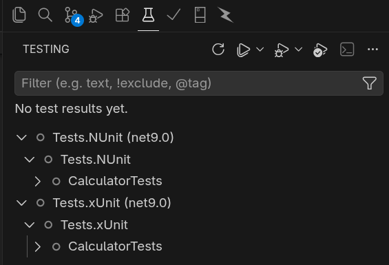

# Project
This is a simple practice-project that showcases Unit Testing in C# with two frameworks, `NUnit` and `XUnit`.

## Solution File
We are configuring this project with a solution file.
- It acts as a container or organizer for one or more related .NET projects.
    - To create a solution file we use the command `dotnet new sln -n MyUnitTestApp`.
    - To add projects we use the command `dotnet sln add <xxxx.csproj>`.
    - To remove projects we use the command `dotnet sln remove <xxxx.csproj>`.
    - To list projects we use the command `dotnet sln list`

## C# Class Library
The code we are testing here is created through a classlib with `dotnet new classlib -n Main -o src/`.

A classlib is just reusable code in a single assembly file which can be used across multiple applications.
- It compiles into a .dll file, and not an .exe so it cant run on its own.
- it doesnt have a Main() method and is ment to be used by other assemblies

### Typically used for:
- Shared business logic.
- Data models.
- Utility / helper classes.
- Common shared code that can be pulled into a testing framework on its own for **Unit Testing**.

## Sequence of commands used for setup:
```bash
# Creates a .sln file to bring everything together as one project
dotnet new sln -n MyUnitTestApp

# Creates a C# class library which we are going to use in both testing frameworks
dotnet new classlib -n Main -o src/

# Creates a NUnit project using the nunit template
dotnet new nunit -n Tests.NUnit -o tests/NUnit
cd tests/NUnit # We have to be inside the folder when adding a reference
dotnet add reference ../../src/Main.csproj # Adds a reference to our classlib project so we can use it in tests.

# Creates a xUnit project using the xUnit template
dotnet new xunit -n Tests.xUnit -o tests/xUnit
cd tests/xUnit
dotnet add reference ../../src/Main.csproj

# Add everything to thee solution
dotnet sln add src/Main.csproj 
dotnet sln add tests/NUnit/Tests.NUnit.csproj 
dotnet sln add tests/xUnit/Tests.xUnit.csproj 

# To see whats currently on the solution
dotnet sln list
```

# NUnit syntax
- `[SetUp]` - Setup Attribute allows a method to run first before the other `[Test]` methods.
    ```c#
    [SetUp]
    public void Before() => _calc = new Calculator();
    ```
- `[Test]` - Flags a method as testable code, this method will likely have `Assert` calls.
    ```c#
    [Test]
    public void Add_ReturnsSum()
    {
        // Arrange
        int param1 = 3;
        int param2 = 7;
        int expected = 10;

        // Act
        int result = _calc.Add(param1, param2);

        // Assert
        Assert.That(result, Is.EqualTo(expected));
    }
    ```
- `[TestCase(a, b)]` - Used to create parameterized tests, allowing a single method to run with multiple set of inputs.
    ```c#
    [TestCase(2, true)]
    [TestCase(7, false)]
    [TestCase(-4, true)]
    public void IsEven_Works(int number, bool expected)
    {
        Assert.That(_calc.IsEven(number), Is.EqualTo(expected));
    }
    ```

# XUnit syntax
- `[Fact]` - A `[Fact]` attribute is used to declare a parameterless method as an individual test to be executed by the test runner.
    ```c#
    [Fact]
    public void Add_ReturnsSum()
    {
        // Arrange
        int param1 = 3;
        int param2 = 7;
        int expected = 10;

        // Act
        int result = Calc.Add(param1, param2);

        // Assert
        Assert.Equal(expected, result);
    }
    ```
- `[Theory]` - A `[Theory]` attribute is similar to a `[Fact]` but with the difference that it can accept parameters
- `[InlineData]` - Used with `[Theory]` and allows the test runnet to run this method multiple times with different sets of input parameters.
    ```c#
    [Theory]
    [InlineData(2, true)]
    [InlineData(7, false)]
    [InlineData(-4, true)]
    public void IsEven_Works(int num, bool expected)
    {
        Assert.Equal(expected, Calc.IsEven(num));
    }
    ```
# Summary

# Usage
1. Clone the repository with `git clone https://github.com/yosang/csharp-unit-test-frameworks`

## Using the CLI
1. Use `dotnet test ` to test both NUnit and xUnit.
2. Use `dotnet test tests/NUnit` to test only the NUnit framework.
3. Use `dotnet test tests/xUnit` to test only the xUnit framework.

## Using Test Explorer in VSCode
Both NUnit and xUnit frameworks should be accessible from the Test Explorer in VSCode, this requires the `C# Dev Kit` extension installed.




# Author
[Yosmel Chiang](https://github.com/yosang)
